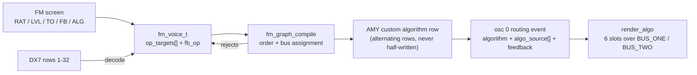
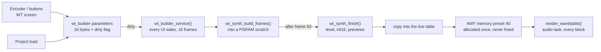

# Voice builders

Two patches are built on the device instead of chosen from a bank:

| | FM Custom | Custom wavetable |
|---|---|---|
| Patch | 276 | 288 (`Wavetable: Custom`) |
| Open with | Menu -> Screen: FM | Menu -> Screen: WT |
| Build option | `CONFIG_SYNTH_CUSTOM_FM` (default off, work in progress) | `CONFIG_SYNTH_CUSTOM_WT` (default on; needs `CONFIG_AMY_WAVETABLE`) |
| What you author | a 6-operator DX7-style FM voice: routing, levels, frequencies, envelopes, feedback | a 64-frame wavetable morphing through three keyframes, from sixteen parameters |
| Saved with the project | not yet: resets to its default voice on boot | yes |
| Controls | [CONTROLS.md](CONTROLS.md#fm-screen) | [CONTROLS.md](CONTROLS.md#wt-screen) |

Both work the same way from the outside:

- **One voice per builder, shared.** Every sequencer row, the arp (and for
  the wavetable, the drones) that plays the patch plays the same authored
  voice. An edit changes all of them at once; it is one instrument, not a
  per-track setting. Per-track sound settings (envelopes, filter, LFO,
  distortion, unison) still apply on top, as for any other patch.
- **Edits are live.** Changes reach the sounding notes while you edit, so
  the usual way to work is to start a pattern on the patch and edit while it
  plays.
- **Button maps live in CONTROLS.md.** This document explains what the
  controls do to the sound and how each builder is put together.

---

## FM Custom (patch 276)

Patch **276 (FM Custom)** is one live-editable 6-operator DX7-style voice on
AMY's ALGO oscillator: a control osc plus six sine operators per note. Every
sequencer row and the arp that use patch 276 play the same voice, so an edit
on this screen changes all of them at once - it is one authored instrument,
not a per-track setting. The fixed FM presets 272-275 are not editable here.
Requires `CONFIG_SYNTH_CUSTOM_FM`; open it with **Menu → Screen: FM**.

The voice is not yet stored in project snapshots: it resets to its default
(algorithm 1, only the OP2 → OP1 pair audible) on boot.

### Screen

Two pages, flipped with `MY_BUTTON_SHOULDER`. Page 1 is the chart and the
panel below; page 2 holds the selected operator's frequency and envelope.

Left on page 1, the operator chart in DX7 algorithm-sheet layout: carriers
on the bottom row over a shared output bus, each modulator stacked above what
it modulates, a small loop on the feedback operator. Operators are labelled
OP1-OP6 as on the DX7 sheets (OP1 is the leftmost carrier of every
algorithm); the selected one is drawn inverted, a muted one is struck
diagonally, and a frame around a box means the cursor is on the chart rather
than in the panel. Right, the selected operator's rows:

| Row | Meaning |
|---|---|
| RAT | Coarse frequency, the same control as page 2's coarse cell: `RAT 2.00` for a ratio operator, `FIX 440` for a fixed-frequency one |
| LVL | 0-100 %. For a modulator this *is* the modulation index (brightness); for a carrier it is that carrier's gain. 0 silences the operator |
| TO | What the operator modulates: OUT (carrier), or one or more other operators (`TO  OP2`, `TO 2+3`) |
| FB | Feedback amount 0-120 %, voice-level - see below |
| ALG | DX7 algorithm 1-32, or CUST for an authored topology |

### Controls

Controls: [CONTROLS.md](CONTROLS.md#fm-screen). From the sequencer grid,
`MY_BUTTON_SHIFT` + encoder on an FM row steps the algorithm without leaving
the grid ([CONTROLS.md](CONTROLS.md#sequencer-screen-seq)).

### Page 2: frequency and envelope

The FRQ cell switches the operator between ratio mode (it tracks the note
at its ratio) and fixed mode (it sounds one frequency whatever the note);
each switch is seeded from what the operator sounds at A4. Coarse steps the
curated ratios 0.5, 1, 1.5, 2 ... 12, 14, 16 while keeping any fine offset,
or a semitone in fixed mode. Fine moves 0.1 Hz, shown in ratio mode as the
operator's frequency at A4.

Each operator has its own DX7-style 4-rate, 4-level amplitude envelope
(EG0), edited as numbers: from L4 a note moves to L1 at rate R1, then to L2
at R2, then to L3 at R3, and holds L3 while the key is down; the release
returns to L4 at R4. Levels are DX7 output levels 0-99 (0.75 dB per step, 0
silent) and rates are DX7 rates 0-99, so an envelope can be typed in from a
DX7 patch sheet. The default is a short percussive shape (R 77 / 32 / 40 /
59, L 99 / 93 / 93 / 0: a 4 ms attack, 290 ms down to L2, a release of about
200 ms) on the DX7 curve - the curve is what makes a modulator envelope sound
like FM instead of a fading sine. The row's ordinary ADSR, opened from the
sequencer, still applies on top as a VCA over the carriers - both shape the
note.

A rate is a slope, not a time. The time a segment takes follows from its
rate and the two levels it joins (`fm_voice_env_times_ms()` in `fm_voice.h`
holds the law, which is the one AMY's `fm.py` converts the built-in DX7
patches with). Six steps of rate halve the time:

| Rate | Fall over all 99 levels | Attack from silence to 99 |
|---|---|---|
| 20 | 18 s | 2.9 s |
| 30 | 6.0 s | 0.92 s |
| 40 | 1.9 s | 0.29 s |
| 50 | 0.61 s | 91 ms |
| 60 | 0.19 s | 29 ms |
| 70 | 61 ms | 9 ms |
| 80 | 19 ms | 3 ms |

A fall over fewer levels is shorter in proportion: at R32 the default's 6
levels from L1 to L2 take 290 ms, and all 99 would take 4.8 s. What follows
from that:

- Changing a level changes the time of the segments on either side of it.
- A segment between equal levels takes no time at any rate, so the envelope
  cannot hold a level before moving on. The release is the exception: between
  equal levels it is timed as a 60-level drop.
- The slowest fall is 1 level per second (R0).
- An attack starts at level 34 if it starts lower; the levels below are
  skipped.

Beside the R/L column a read-only plot draws the envelope: level on the
vertical axis, segment widths log-compressed in time, a short fixed stub for
the sustain. The segment of the R or the point of the L under the cursor is
marked, and the trace is dotted while the operator is muted.

`MY_BUTTON_2` mutes the selected operator on either page, for auditioning;
mute is not saved.

### Custom topologies and their limits

Turning TO, linking, or moving the feedback loop switches ALG to CUST,
seeded from the algorithm you were on, fan-out included, so you always start
from what you were hearing. The ALG row (or `MY_BUTTON_SHIFT` + encoder on
this screen) walks 1 ... 32 then CUST and wraps; CUST keeps the last
authored topology until you edit it again.

- **Fan-out.** An operator either goes to OUT or modulates one or more
  other operators, as in the DX7 algorithms where one modulator feeds two.
  The TO row sets a single target; link mode (`MY_BUTTON_1` on page 1, see
  [CONTROLS.md](CONTROLS.md#linking)) adds and removes targets. A fan-out
  connection has no depth of its own: the modulator's level and envelope
  drive every target equally. The chart stacks a modulator above its first
  target only, so a further target's connector may cross other boxes.
- **Two modulation buses.** AMY renders the six operators in sequence through
  two shared block buses (plus a scratch copy for the read-and-overwrite
  case), which is why routing is a compiled program rather than free wiring.
  The compiler searches render orders and bus assignments so every modulator
  renders before what it modulates, and refuses a graph that would need a
  third bus; link mode shows such a link as `LINK: NO BUS`. With six
  single-target operators every acyclic wiring fits (all 16,807 of them), so
  the TO row only ever skips cycles; some fan-out shapes do not fit.
- **No cycles.** TO skips the operator itself and anything already modulating
  it, and link mode refuses a loop (`LINK: LOOP`). The buses hold whole
  256-sample blocks, so a routing loop would be block-delayed feedback, not
  FM feedback - that is what the FB flag is for.
- **One feedback operator, one amount.** Self-feedback is the DX7 kind (the
  operator's own last two output samples, averaged, added to its phase every
  sample) and is a flag on exactly one operator; the amount lives on the
  voice, which is the FB row. The FB row is struck through while the
  selected operator is not the one carrying the loop; clicking it there moves
  the loop to that operator, clicking it on the loop's operator adjusts the
  amount. FB at 0 % disables the path, so a loop with no amount is silent.
- **Level, not on/off.** There is no operator enable (mute is audition
  only); an unused operator is one at LVL 0 %. The default voice ships with four operators at 0 % for
  exactly this reason.

### Ranges and guard rails

| Value | Range |
|---|---|
| Ratio | 0.25 .. 20 |
| Fixed frequency | 1 .. 9772 Hz |
| Level | 0 .. 100 %, 5 % steps |
| Feedback | 0 .. 120 %, 5 % steps |
| Envelope levels | 0 .. 99 (0.75 dB per step, 0 silent) |
| Envelope rates | 0 .. 99 |
| Envelope times, as sent to AMY | first segment at least 2 ms, release at least 5 ms, any segment at most 60 s |

Velocity reaches the carriers through the voice's control oscillator, not
the operators, so playing harder makes the note louder without changing the
modulation depth.

A refused routing edit (a cycle, or a shape that needs a third bus) leaves
the voice exactly as it was; the editor never commits half a change.

### Presets and the Custom voice

FM Bass, FM E.Piano, FM Bell and FM Lead (272-275) are fixed voices built in
code. There is no "copy this preset into Custom": the Custom voice starts
from its own default and keeps whatever you author until reboot. The one
bridge is the algorithm: stepping ALG on Custom, or editing a topology,
starts from the DX7 row you are on.

On the sequencer grid, `MY_BUTTON_SHIFT` + encoder on a layer with a Custom
row steps the Custom voice's algorithm (the same as the ALG row). On the
fixed presets and the DX7 bank it sets a per-layer algorithm override instead,
which is saved with the project.

### How it is built

| File | Role |
|---|---|
| `components/synth_core/custompatches/fm_voice.c`, `include/custompatches/fm_voice.h` | The voice (`fm_voice_t`), its default, setters, value ranges and edit steps, and the events that push it to AMY |
| `components/synth_core/custompatches/fm_graph.c`, `include/custompatches/fm_graph.h` | Routing masks, cycle check, and the compiler from a custom topology to an AMY algorithm row |
| `components/synth_core/custompatches/fm_presets.c` | The four fixed FM presets |
| `components/synth_core/synth_ui/ui_screen_fm.c` | The screen: cursors, edits, link mode, view building |
| `components/display/display_fm.c` | The chart, panel and envelope plot |

Each note of patch 276 is one AMY voice of seven oscillators: osc 0 is the
ALGO control oscillator (it carries the algorithm, the feedback amount, the
row's ADSR as a VCA over the carriers, and velocity), and oscs 1-6 are the
six sine operators, each with its own DX7-curve envelope.

An edit on the screen changes the one global voice (`s_fm_voice`) and then
calls `sequencer_core_fm_voice_changed()`, which pushes the change to every
melodic row on patch 276 and to the arp if it plays it. The push is scoped
to what changed: one operator's event, the routing event on osc 0, or the
whole voice. Events go through the app's AMY ingest queue like every other
edit, so the screen never holds AMY's lock.

A custom topology is compiled into one of AMY's RAM algorithm rows. The
compiler writes the row that no sounding note is using and then switches the
voice to it, so the render never reads a half-written row.

---

## Custom wavetable (patch 288)

A wavetable is a stack of 64 single-cycle waveforms, called frames. A note
plays one position in the stack, and moving that position (with an envelope,
an LFO, a fixed setting per track or a lock per step) moves the timbre.
AMY reads two neighbouring frames and crossfades between them, so positions
between frames are smooth.

The custom wavetable is built from three keyframes: **A** is frame 0, **M**
is frame 32 and **B** is frame 63. Frames 0 to 32 morph from A to M, frames
32 to 63 from M to B. You set each keyframe with five parameters, plus one
Harmonics setting for the whole table: sixteen parameters in all. The table is rebuilt
after every edit, in the background, and replaces the old one within about
50 ms.

### What the parameters do

The sound model is a **hard-synced oscillator**: a slave waveform that
restarts at the start of every cycle.

- **Sync** is the slave's speed relative to the note, 1.0 to 8.0. At 1.0 the
  slave is just the waveform; at whole numbers it is that many waveform
  periods per cycle (2.0 an octave up, 4.0 two octaves up); between whole
  numbers you get the cut-off, vocal "sync" timbre. Sweeping Sync from A to B
  is the classic sync sweep.
- **Shape** is the slave's waveform: saw at 0, square at 100, a blend in
  between. Shape and Sync combine: a square synced at 3.5 is a different
  sound from a saw synced at 3.5.
- **Width** is the pulse width of the square part, 10 to 90 percent of each
  slave period; 50 is the symmetric square. It acts only through the square
  part, so it does nothing at Shape 0 and the most at Shape 100. Moving it
  between keyframes gives pulse-width modulation along the table.
- **Bright** sets how fast the harmonics above the sync harmonic fall away:
  10 leaves the waveform as it is, lower values roll the top off, 0 is close
  to a sine at the sync pitch. Below the sync harmonic nothing changes.
- **Peak** adds a resonant bump (+12 dB) on one harmonic, 2 to 63, or Off. It
  is counted in harmonics of the note, so it moves with the pitch you play
  (a wavetable cannot hold a formant at a fixed frequency). A keyframe with
  Peak Off borrows the position of a set one, so the bump fades in and out
  in place instead of sliding up from the bottom: an Off A takes M's
  harmonic if M is set, else B's; an Off B takes M's, else A's; an Off M
  takes the harmonic halfway (in pitch) between A and B if both are set,
  else the one that is set. All three Off is no bump.
- **Harmonics** sets how many harmonics a frame may hold: 63, 31 or 15.
  More is brighter. The cell also shows the highest note that plays without
  aliasing at that count: `63 F#4`, `31 F#5`, `15 G6`. One table
  serves every note, and a high note pushes its upper harmonics past what
  the 48 kHz output can carry; those fold back as inharmonic noise. Use the
  highest count whose note still covers the part: 63 for bass lines, 31 or
  15 for leads. A lower count than the part needs only removes harmonics.

Between neighbouring keyframes, Shape, Width, Bright and the Peak's strength
move evenly; Sync and the Peak's harmonic move evenly in pitch (each frame
the same musical step), which is how a sweep sounds even. Frame 32 is
exactly M.

### Things to try

| Sound | A | M | B |
|---|---|---|---|
| A plain saw, as a starting point | default (Button 2 resets A or B) | Button 1 on A copies it here | Button 1 on M copies it here |
| Brightness morph, a filter sweep without the filter | Bright 2 | blend | Bright 10 |
| Saw to square | Shape 0 | blend | Shape 100 |
| Pulse-width sweep | Shape 100, Width 50 | Shape 100, Width 10 | Shape 100, Width 50 |
| Classic sync sweep | Sync 1.0 | blend | Sync 6.0 |
| Sync up and back down | Sync 1.0 | Sync 6.0 | Sync 1.0 |
| Talking formant | Peak 3 | Peak 14 | Peak 6 |
| Octave stack (QuadSaw-like end) | Sync 1.0 | blend | Sync 4.0 |
| Dark sync | Sync 1.0, Bright 3 | blend | Sync 5.5, Bright 3 |

`blend` in the M column: set A and B, then press Button 2 with M focused.
That sets M to the halfway point of A and B, and the table plays the plain
A-to-B morph.

Then route EG -> SCN (Scan) on the row's envelope, or an LFO to Scan, to
sweep through the table per note, or use the frame position below.

### Frame position: Frame and FRM

Any wavetable patch (the built-in banks and the custom table) has two more
controls outside the WT screen:

- **Frame** on the Layer page sets the frame each note starts on: `Auto`
  (the resting position the EG -> SCN routing implies: the first frame, the
  last, or the middle when nothing is routed) or a fixed frame 0..63.
  Envelope and LFO Scan modulate around it.
- **FRM** in the step editor locks one step to a frame, 0..63, overriding
  Frame for that step. A pattern with a different FRM on each step plays a
  different timbre per step.

The frame is part of each note: a note keeps the frame it started on, so a
held chord does not jump when a later step is locked elsewhere.
Controls: FRM in [CONTROLS.md](CONTROLS.md#step-trig-popup), the Frame row
under the Layer page in [CONTROLS.md](CONTROLS.md#menu).

### What it will not let you build

The parameters are chosen so that every table they can make plays cleanly in
AMY:

- **No aliasing up to the note shown beside Harmonics.** Every frame stops
  at the Harmonics count. Above G6 every setting aliases; the smallest
  count is 15, because fewer harmonics leave the parameters nothing to
  shape.
- **No dips in the morph.** Neighbouring frames are close, so AMY's
  crossfade between them never cancels the sound. The one exception is
  below.
- **No level jumps.** Every frame is levelled to the same loudness as a
  plain saw, so sweeping the frame position or changing Shape does not jump
  in volume. A Peak adds level, as a resonance does.
- **No silent frames.** Saw and square share the sync harmonic, and the
  smallest Harmonics count (15) is above the highest Sync (8.0), so no
  setting removes every harmonic.
- **No clicks at the loop point.** Frames are built from harmonics, so every
  cycle joins itself exactly.

### Known limits

- **Sync sweeps ripple slightly between frames.** Near high Sync values the
  harmonics' phases move a lot from one frame to the next, so a position
  halfway between two frames is up to about 2 dB quieter. This is the same
  in the built-in SyncSweep table; the alternative would no longer be a
  real hard-sync waveform. A Sync change packed into one half of the table
  (A to M, or M to B) moves twice as far per frame and ripples up to about
  3.4 dB between frames, against about 2 dB across the whole table.
- **A narrow pulse widens quickly as Sync leaves 1.0.** The slave's restart
  starts a second pulse at the end of the cycle, next to the first one. With
  Width 10 and a fast Sync sweep (1.0 to 8.0 in one half of the table) the
  pulse goes from 10 % to about 16 % in the first frame, a larger timbre
  step than anywhere else in the table.
- **A narrow pulse lowers the whole table's level.** A narrow pulse has a
  high peak for its loudness, and the finished table is scaled down to its
  highest peak, so a table containing a 10 % pulse comes out quieter
  overall, on every frame: about 6 dB (5.5 to 6.3 dB depending on Harmonics) at
  Bright 10, about 0.2 dB at Bright 0.
- **A Square LFO on a wavetable row** becomes a narrower pulse when Frame or
  FRM is set between 1 and 62: the note's frame position also reaches the
  LFO oscillator, which reads it as pulse width. Frames 0 and 63, and Auto,
  leave it square.
- **An edit while notes sound** can, for one 5.3 ms audio block, mix the old
  and the new table. A detent's change is too small to hear; a keyframe copy
  or reset (Buttons 1 and 2) can click once.

### How it is built

| File | Role |
|---|---|
| `components/synth_core/custompatches/wt_synth.c`, `include/custompatches/wt_synth.h` | The spectrum model: parameters in, 64 frames out. Pure math, no AMY or RTOS calls |
| `components/synth_core/custompatches/wt_builder.c`, `include/custompatches/wt_builder.h` | Owns the parameters, the buffers and the rebuild; the table's AMY preset |
| `components/synth_core/synth_ui/ui_screen_wt.c` | The screen: cursor, edits, buttons, view building |
| `components/display/display_wt.c` | The keyframe tabs, parameter cells and full-width waveform |
| `components/synth_core/custompatches/wavetable_bank.c` | Maps patch 288 to the builder's preset and names it |
| `components/synth_core/project/project_snapshot.c` | The `WTCU` section: the sixteen parameter bytes |

**The spectrum model.** For each frame, `wt_synth_build_frames()`
interpolates the parameters between the two keyframes around it (A and M,
or M and B) and builds the frame's harmonics directly: the exact spectrum of
a hard-synced saw and of a hard-synced pulse of the given Width, computed
from the steps in each waveform and blended by
Shape; the Bright slope above the sync harmonic; levelling to a plain saw's
loudness; the Peak; the Harmonics cap. An inverse FFT then turns the harmonics
into the 256-sample frame. Building from harmonics is what makes every frame
band-limited and loop-continuous by construction.

**Rebuild and swap.** Edits only set parameter bytes and a dirty flag, from
whichever task handles the input. The UI task's `wt_builder_service()` builds
16 frames per wake (every 10 ms), so a full table is spread over about 50 ms
and no wake carries the whole job. The finished table is converted to 16-bit
in place in the scratch and copied into the live buffer. That buffer is the
sample memory of AMY preset 40, allocated once at boot and never freed, so
the audio task can keep reading it while the copy runs; at worst one block
reads part old, part new.

**Frame position.** A note-on on a wavetable row carries its frame position
in the same AMY event as its pitch and velocity
(`amy_helpers_note_send_duty()` in `amy_helpers.h`). AMY applies a note-on's
fields to the voice it allocates and to no other, which is why each note
keeps its own frame.

**Saving.** The project stores the sixteen parameter bytes (`WTCU` section),
never the table; a load sets the parameters and the table is rebuilt within
about 50 ms. A project without the section loads the default saw. The track
Frame values and step FRM locks are stored with the layer.
