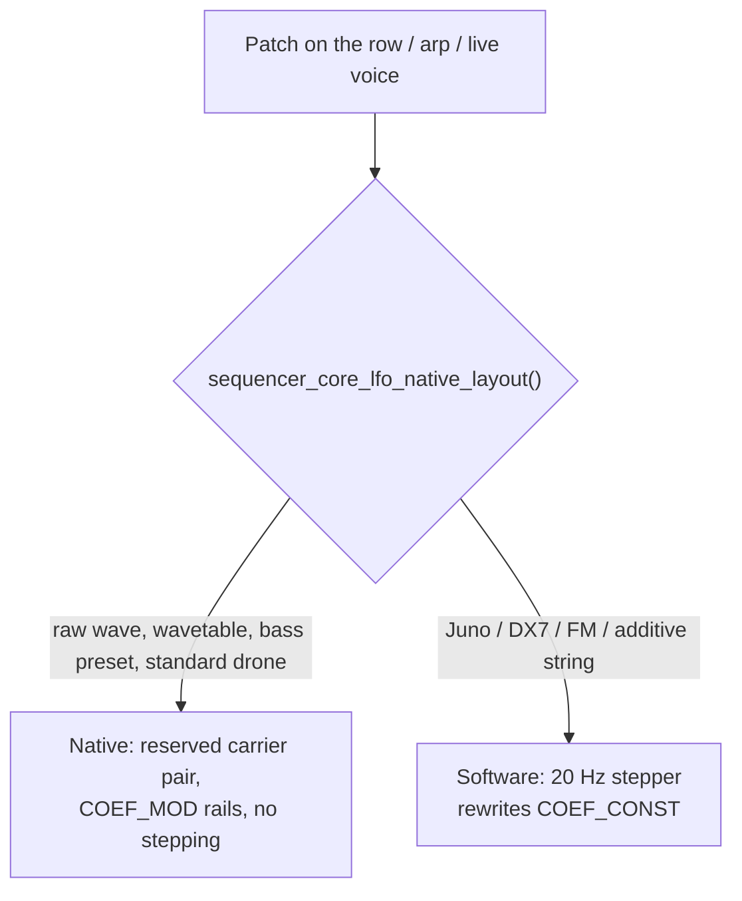

# Engine semantics - app conventions over AMY

Rules the sequencer, arp, drone and live voice share when they drive AMY, and
that no single header can state alone. AMY's own parameter semantics (control
coefficients, breakpoint sets, log2 pitch, dB amp combine) are documented in
`components/amy/docs/synth.md` and `components/amy/docs/api.md`; this file states only what the app
does on top of them. Source comments cite a section here instead of repeating
it.

## LFO: native carrier vs software stepper

An LFO reaches the sound one of two ways, chosen per patch by one predicate,
`sequencer_core_lfo_native_layout()` (`sequencer_core.h`).

**Native.** The voice reserves a trailing osc pair: the carrier (an AMY
oscillator at the BPM-synced LFO rate, RANDOM mapped to the NOISE sample-and-
hold) and the wobble modulator chained behind it. The audible oscs name the
carrier as `mod_source`, and each checked target's COEF_MOD depth is set once
(`voice_apply_native_lfo_topo()`, `voice_config.c`): filter, amp, pitch, scan,
pan and both distortion rails. Nothing is stepped, so there is no zipper. The
per-target depth scalars are the `VOICE_LFO_DEPTH_*` constants in
`voice_config.h`.

**Software.** A patch string owns its whole osc layout, so there is no free
osc to serve as carrier, and naming one as `mod_source` would mute it. The
20 Hz stepper (`sequencer_core_lfo_service()` for sequencer rows, with the same
law in `arp_core.c` and `live_play.c`; mechanics in
`sequencer_core/software_lfo.md`) recomputes each checked target's COEF_CONST
and re-sends it. The rate is capped at `SEQ_LFO_SW_MAX_HZ`. WOBBLE
and SCAN have no software analog. Pitch is written to osc 0 only, because a
synth-wide event would also rewrite the patch's internal modulator oscs' freq
CONST, which is their rate. On ALGO voices (the FM range and the DX7 bank) AMP
is written to osc 0 as well, because an operator's amp CONST is its output
level (`sequencer_core_patch_amp_osc()`).

**One predicate.** Every gate must use `sequencer_core_lfo_native_layout()`. A
site left on `sequencer_core_is_wave_patch()` would run the stepper on a native
carrier and modulate twice.

**Distortion.** DRIVE and MIX are independent target bits. AMY has COEF_MOD
rails for both (`dist_logdrive_coefs`, `dist_mix_coefs`), so on a native layout
they ride the carrier like every other target; the stepper drives them only on
software patches (`voice_push_dist_lfo()`), with the same law. The per-target depth
law (drive in octaves, mix linear) is stated in the top-level README, LFO
editor section. With the shaper OFF the target is inert:
the LFO never switches distortion on.

## Voice blocks and deferred authority

Each melodic row owns one AMY synth slot and reads its editable voice
parameters (`voice_params_t`: EG0, EG1, filter, LFO, distortion, trim) from one
of two stored blocks.

- **Source selector.** A row reads its own block or the layer's shared one;
  the API contract is in `sequencer_core.h`, "Voice-block source selector".
  Every push, service and editor path resolves the block through
  `seq_track_vp()`, and a commit reaches every row reading the written block
  (`sequencer_core_melodic_vp_peers()`).
- **Deferred authority.** The patch owns a parameter group until the user
  commits it in an editor, which sets the group's `*_authored` flag. Authored
  groups are pushed to AMY after every patch load; unauthored groups are left
  to whatever the patch string baked in. Raw waves and wavetables have no
  built-in EG0, so their envelope is always pushed. A zeroed block is
  unauthored but has zero trim, which is silent; `voice_params_init_defaults()`
  is the one place the unity trim is set.
- **Release to patch.** `sequencer_core_release_melodic_group()` clears one
  group's flag on the block the row reads and reloads the layer so the patch's
  own values sound again; the stored values stay for a later commit.
- **Drum rows** are the exception: their defaults are app data, so an
  unauthored drum row's model is seeded from the drum bank's tuning blocks and
  pushed, and the editors open on the curve that is sounding.

## Editor preview and cancel

Editors audition scratch values against the running engine without touching
the store or the authored flags. A preview call pushes to AMY only. Commit goes
through the normal setter. Cancel re-pushes the stored state through the same
preview calls - except for a never-authored row, whose live state came from the
patch and cannot be rebuilt from the store: cancel then calls
`sequencer_core_reload_layer_synth()`, which restarts the layer's voices
briefly. On a LAYER-source row the preview and the cancel-restore run over the
whole peer set. The LFO preview also occupies a slot the software stepper reads,
so editors call `sequencer_core_preview_melodic_clear()` on every close path,
commit and cancel alike.

## Where each AMY-facing fact is stated

| Fact | Home |
|---|---|
| freq COEF_CONST is Hz stored as log2(f/440); pitch pushes anchor on 440 Hz | `SEQ_LFO_PITCH_BASE_HZ`, `voice_config.h` |
| Amp combine is in dB; wobble applies downward-only | `VOICE_WOB_DEPTH_AMP`, `voice_config.h` |
| A never-configured breakpoint set reads as a constant 1.0 | `sequencer_core_push_envelope_eg1()`, `sequencer_core.h` |
| An unconfigured osc plays a full-level SINE, so reserved oscs are parked | `voice_wave_cfg_t`, `voice_config.h` |
| An event naming osc N reaches osc N of every voice | "Reach" in `voice_config.h` |
| Note-offs match by note number | `seq_apply_track_note()`, `seq_core_engine.c` |
| Clear the schedule before a patch rebuild | `sequencer_reconfigure_layer_paused()`, `seq_core_synth.c` |
| Juno patch strings end with EQ/chorus commands, so bus FX are reasserted | `synth_ui_fx_reassert()`, `amy_fx.h` |
| An inactive FX bus is held muted | `fx_push_eq()` group, `amy_fx.h` |
| Send is not apply; lock order; NOTE vs CONFIG route | `amy_helpers.h` |
| The render task cannot send; trig jobs use the pump's urgent source | `seq_trig_pump.c` |
| Plain vs decorated step | `seq_core_trig.c` |
